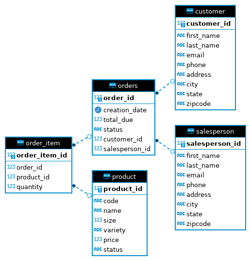

# Introduction

The purpose of the JDBC application was to become familiarized with Java's API to connect a Java
application to an RDBMS through the Java SQL libraries. This JDBC application creates a connection between 
a Java application, and a PostgreSQL RDBMS to implement CRUD functionality with JDBC APIs, allowing the user
to create, read, update, and delete data. The application was designed to implement two DAO (Data Access Object)
implementations from a sample database, for customers and orders. The technologies used to create this application are
as follows:
- Docker
- Java
- PostgreSQL
- JDBC
- Intellij

# Implementation

## ER Diagram

## Design Patterns
### DAO (Data Access Object) Pattern
- DAO's are one of the most common patterns when dealing with databases, as they provide
an abstraction layer between the JDBC code and the business logic. When used as an interface,
  the input and output will be a `Data Transfer Object (DTO)`, which are encapsulated objects 
  that provide a single domain of data. DAO's are useful as they allow for us to have a single
  instance of the database and to compute the joins using foreign keys.

### Repository Pattern
- The repository pattern focuses on a single table accesses per class, thus allowing joins to be 
performed in the code after all the data has been selected from multiple tables. The repository patter
  is useful when it is needed to scale a database horizontally, resulting in a more distributed system.

# Test
This application was manually tested with a PostgreSQL instance through docker using the `JDBCExecutor` class.
This class acted as the client, as tests were executed through the main method. Using the `CustomerDAO` and `OrdersDAO` classes,
DTO (Data Transfer Objects) were returned, and their outputs were displayed on the console to compare results.
