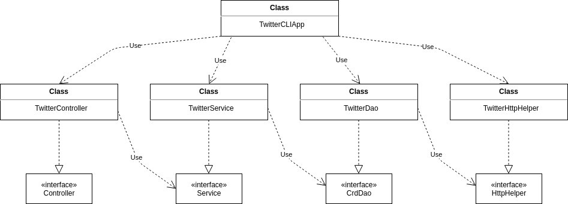

# Introduction
This application is a Twitter Command Line Interface that is able to create, search, and delete
tweets in real time based on user input. The app uses the Twitter REST API to enable
these functionalities through an HTTP Client to run the requests and uses the Jackson Library to parse
and convert the JSON objects to Tweet Objects. This application is packaged using Docker, where user's can 
pull the image from DockerHub to be implemented. The technologies used to create this application are as follows:

- Java
- Apache Http
- Spring
- Twitter REST API
- Maven
- Docker

# Quick Start
Before running the application the user must obtain the API key, API secret key, Access Token, and Secret Token
from the Twitter API
- Usage: `TwitterCLIApp post|show|delete [options]`

## Maven
```bash
# Build package using maven
mvn clean package

# Run jar file
java -jar -cp target/twitter-1.0-SNAPSHOT.jar post|show|delete [options]
```

## Docker

```bash
# Pull docker image
docker pull keithan/twitter

# Create and run docker container
docker run --rm \
-e consumerKey=YOUR_VALUE \
-e consumerSecret=YOUR_VALUE \
-e accessToken=YOUR_VALUE \
-e tokenSecret=YOUR_VALUE \
keithan/twitter post|show|delete [options]
```

# Design

## UML diagram



- `TwitterDAO`: The DAO layer is th Data Access Layer, it communicates with the HTTP Client and the
  Twitter Rest API to create DTOs and according to the specifications
- `TwitterService`: The service layer contains the business logic of the application and interacts
  with the `TwitterDAO`. It is the layer that validate the actual information in the arguments to
  ensure proper standards.
- `TwitterController`: The controller interacts with the client and parses user input to validate
  they are in correct format before sending them to the service layer.
- `TwitterCLIApp`: This is class that initiates all dependent components and calls the `run` method,
  which takes command-line arguments, performs an HTTP request, and prints response body tweets.

## Models
This application implemented 5 classes to represent a simplified version of the Tweet Model

- `Tweet`: Simplified version of the Twitter Tweet model 
- `Entites`: Contains `Hashtag` and `UserMention`
- `Hastag`: Shows hashtag text in a posted tweet
- `UserMention`: Shows users that have been mentioned in a posted tweet 
- `Coordinates`: A list containing longitude and latitude coordinates representing the location of the tweet


## Spring
In this application dependencies are handled using the Spring framework. Java class annotations are
implemented to signify the beans, and their use cases as well as the use of the `@Autowired` tag to 
inject their dependencies to the constructor. In this application the components are organized as listed
below:

- `@Component`: `TwitterAppCLI`, `TwitterHttpHelper`
- `@Controller`: `TwitterController`
- `@Service`: `TwitterService`
- `@Repository`: `TwitterDAO`

# Test
JUnit is used to perform integration tests on all classes and Mockito framework is used to test
classes with dependency utilizing the ability to mock the dependency. 

## Deployment
First packaged the program into a jar file, and then using the jar file for the Dockerfile
to use when creating the image of the whole application. After the image creation, it was tested on the CLI
then pushed to DockerHub.

# Improvements
- Pull coordinate location of user from device location, rather than user entering the longitude and latitude.
- Allow the user to edit or update a tweet they posted.
- Allow the user to retrieve a tweet with a parameter other than the tweet id.