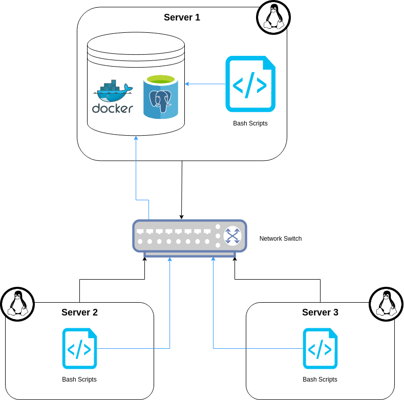

# Linux Cluster Monitoring Agent
# Introduction
The Linux Cluster Monitoring Agent is a tool used to monitor remote Linux servers. Each server is connected through a network 
switch communicating through IPv4 addresses. This tool is implemented with monitoring agent scripts which will gather 
hardware specifications as well as monitor resource usage in real time. This project executes a bash script to initialize a PostgreSQL
database within a docker container to store all the information gathered by the monitory agent scripts.
The technologies used to create this tool are as follows:
- Docker
- Linux
- PostgreSQL
- Bash
- GitFlow

# Quick Start

- Start a PostgreSQL instance using `psql_docker.sh`
  ```bash
  ./scripts/psql_docker.sh create|start|stop [username] [password]
  ```
- Create database tables to contain hardware specifications and resource usage using `ddl.sql`
  ```bash 
  psql -h localhost -U [username] -d [database] -f sql/ddl.sql
  ```
- Retrieve and insert hardware specifications into the database using `host_info.sh`
  ```bash
  ./scripts/host_info.sh localhost 5432 [database] [username] [password]
  ```  
- Retrieve and insert resource usage into the database using `host_usage.sh`
  ```bash
  ./scripts/host_usage.sh localhost 5432 [database] [username] [password]
  ```  
- Implementing 'host_usage.sh' automation with `crontab`
  ```bash
  # Open contrab editor to create a new job
  contrab -e
  
  # Add the line to the open editor to collect the usage data every minute
  * * * * * [full file path to]/linux_sql/scripts/host_usage.sh localhost 5432 [database] [username] [password]
  ```
# Implemenation
- To run this project you must first provision a PostgreSQL database using docker with the `psql_docker.sh` script. 
This script takes 3 input arguments, the first being if you would like to `create`, `stop`, or `start` a provision of a PostgreSQL database, and the following input arguments are the `username` and `password` of the PostgreSQL database on this server.
- After creating a new database, you must start the docker container, by running the `psql_docker.sh` script again using the `start` input argument 
- Once the docker container of the PSQL database is active, you can now proceed with creating and implementing the tables for the database by running the `ddl.sql` script
- Upon the tables being successfully created the database is  now ready to be populated with the hardware specs and resource usage of the server by the execution of both `host_info.sh` and `host_usage.sh` scripts
- The `host_usage.sh` script is used to collect the hardware specifications using the `lscpu` command and insert the data into the PSQL database
- The `host_info.sh` script is used to collect the real time resource usage of the server using the `vmstat` command and insert the data into the PSQL database
    - The automation of the `host_info.sh` using `contrab` will allow for the user to see CPU usages in real time to aid with any server maintenance or monitoring

## Architecture Diagram


## Scripts
- `psql_docker.sh`
    - This script allows three input arguments `create | start | stop [username] [password]`
    - `create` is used when the user wants to make a PostgreSQL instance provisioned by Docker. When this input is triggered the script will check if a container with this name already exists on the server before creating one.
    - `start` is used after a PostgreSQL database is already created and to start running the Docker container.
    - `stop` is used to halt the running Docker container housing the PostgreSQL database.
    - The `username` and `password` arguments are used as the username and password for the PostgreSQL database.
  ```bash
  # Creating a PSQL docker container with the given username and password
  ./scripts/psql_docker.sh create [username] [password]
  
  # Start PSQL docker container
  ./scripts/psql_docker.sh start
  
  # Stop PSQL docker container
  ./scripts/psql_docker.sh stop
  ```
- `host_info.sh`
    - This script is used to parse the hardware specifications of the server and stored in the host_info table in the PSQL database
  ```bash
  # Get hardware specs and insert them into the host_info table in the PSQL databse
  ./scripts/host_info.sh localhost 5432 [database] [username] [password]
  ```
- `host_usage.sh`
    - This script is used to parse the resource usage of the server and store it in the host_usage table in the PSQL database 
  ```bash
  # Get resource usage information and insert them into the host_usage table in the PSQL database
  ./scripts/host_usage.sh localhost 5432 [database] [username] [password]
  ```
- `crontab`
    - Allows for host_usage script to parse real time information about the server and update the host_usage table by executing the script every minute
  ```bash
   # Open contrab editor to create a new job
  contrab -e
  
  # Add the line to the open editor to collect the usage data every minute
  * * * * * [full file path to]/linux_sql/scripts/host_usage.sh localhost 5432 [database] [username] [password]
  
  # To check if the crontab implementation was successful use this command to ensure that the job is running
  crontab -l
  ```
- `queries.sql`
    - This script answers some useful queries used to help the business team answer some questions for resource planning:
    1. Group hosts by number of CPUs and total memory size in descending order
    2. Get the average memory usage percentage in 5 minute intervals for each host
    3. Detect if a host has failed during a crontab job. Failure is classified if a host fails to insert less than three 
       data points into the host_usage table within a 5-minute interval.

## Database Modeling
The `host_info` table stores all the hardware specifications of each node. The table schema is as follows:

|       Field      |                                             Description                                            |
|:----------------:|:--------------------------------------------------------------------------------------------------:|
|        id        |                      Unique identifier for each host that is auto-incremented                      |
|     hostname     |                                      Unique name for each host                                     |
|    cpu_number    |                                         Number of CPU cores                                        |
| cpu_architecture |                                      Name of CPU architecture                                      |
|     cpu_model    |                                          Name of CPU model                                         |
|      cpu_mhz     |                                    Clock speed of the CPU in MHz                                   |
|     L2_cache     |                                 Size of Level 2 cache memory in kB                                 |
|     total_mem    |                                    Size of total memory on host                                    |
|     timestamp    | Time of when host_info specifications were recorded in 'Year-Month-Day Hour:Minute:Second' format  |


The `host_usage` table stores all the resource usage information, which is updated every minute. The table schema is as follows:

|      Field     |                                             Description                                            |
|:--------------:|:--------------------------------------------------------------------------------------------------:|
|    Timestamp   | Time of when host_info specifications were recorded in 'Year-Month-Day Hour:Minute:Second' format |
|     host_id    |                          Host identifier corresponding to host_info table                          |
|   memory_free  |                                     Amount of memory available                                     |
|    cpu_idle    |                               Percentage of time that CPU is in idle                               |
|   cpu_kernel   |                          Percentage of time CPU is running in kernel mode                          |
|     disk_io    |                          Number of disks undergoing Input/Output processes                         |
| disk_available |                    Amount of available space in the disk's root directory in MB                    |

# Test
Since this solution is designed as a minimum viable product all tests were implemented on one server, but can be 
implemented throughout multiple servers and still achieve the same results.
- Each bash script (`psql_docker.sh`, `host_info.sh`, and `host_usage.sh`) was tested manually through the Linux shell
- `ddl.sql` was tested manually by executing it in the terminal and checking if the database and tables were successfully 
created using the following commands:
  ```bash
  # Open PSQL editor to check if database is created
  psql -h localhost -U [username] -W
  
  # List all tables to confirm if tables have been created
  postgres=# \dt
  ```
- `queries.sql` was tested by inserting synthetic data into a mock database and running the queries and comparing the 
results produced to the expected results.
  
# Improvements
Some improvements that could have been implemented are as follows:
- Create an alert if the SQL queries detects that the server has failed, allowing for server maintenance to be notified
  immediately.
- Create a docker container immediately if a user asks to start a container that those not exist yet.
- Generate hourly and daily reports on the server's resource usage in a more readable format, such as a JSON file.