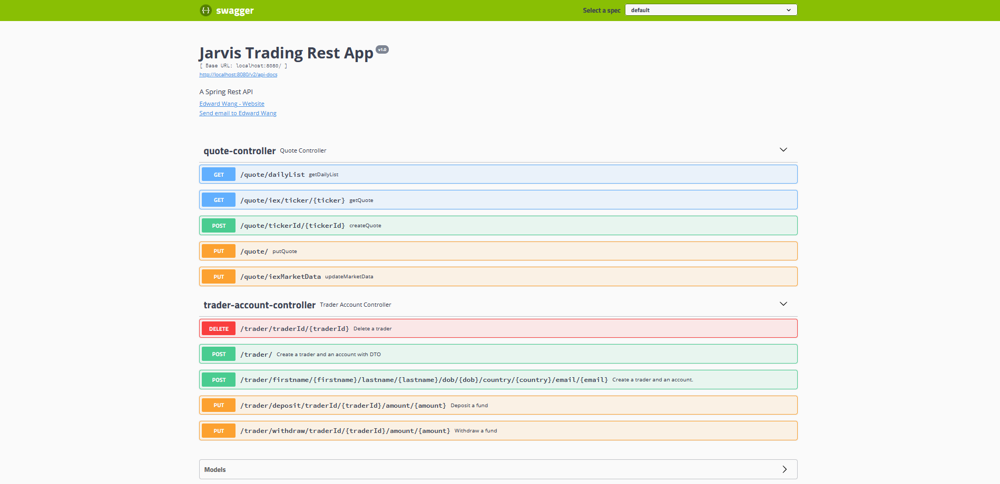
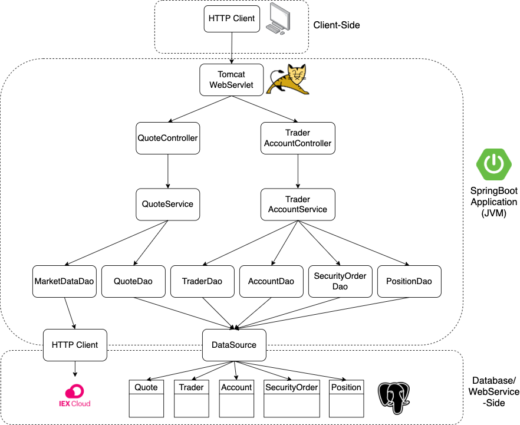
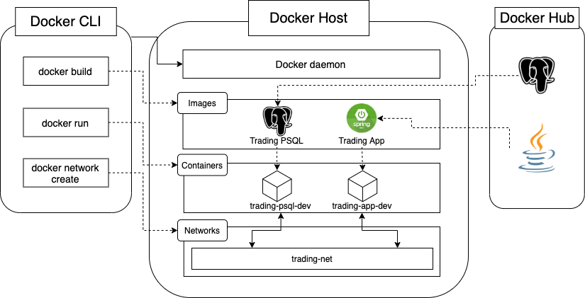

# Table of contents
* [Introduction](#Introduction)
* [Quick Start](#Quick-Start)
* [Architecture](#Architecture)
* [REST API Usage](#REST-API-Usage)
* [Deployment](#Deployment)
* [Improvements](#Improvements)

# Introduction
The Springboot Trading Applicaiton is an online stock trading REST API designed to update Jarvis' old and monolithic platform.
The API allows users to manage trading clients and accounts, as well as pull and post market data. This trading REST API provides
a PoC with a microservice architecture that will allow for ease of future scalability. It also implements Springboot frameworks as 
well as a MVC design pattern to manage the code structure. The application retrieves real-time and historical market data from the IEX
Cloud API and stores the data in a PostgreSQL database.

# Quick Start
Prequiresites: Docker, CentOS 7

Docker:
1. Create a docker network with the following command
```bash
sudo docker network create trading-net
```
2. Build the docker images from the provided Dockerfiles
```bash
cd ./springboot/psql
docker build -t trading-psql .
```
```bash
cd ./springboot
docker build -t trading-app .
```
3. Start the PSQL container and attach it to the network
```bash
#start a docker container
#attached the container to the trading-net network
docker run --name trading-psql-dev \
-e POSTGRES_PASSWORD=password \
-e POSTGRES_DB=jrvstrading \
-e POSTGRES_USER=postgres \
--network trading-net \
-d -p 5432:5432 trading-psql
```
4. Start the trading app container and attach it to the network
```bash
#set IEX credential
IEX_PUB_TOKEN="your_token"
#start trading-app container which is attached to the trading-net docker network
docker run --name trading-app-dev \
-e "PSQL_URL=jdbc:postgresql://trading-psql-dev:5432/jrvstrading" \
-e "PSQL_USER=postgres" \
-e "PSQL_PASSWORD=password" \
-e "IEX_PUB_TOKEN=${IEX_PUB_TOKEN}" \
--network trading-net \
-p 8080:8080 -t trading-app
```
5. The API should now be accessible from http://localhost:8080/swagger-ui.html


# Implemenation
## Architecture

#### Controller Layer
The controller layer handles the HTTP requests and is responsible for controlling the flow of application and its logic. It
essentially acts as a communicator, getting the data from the API requests, converts it into a more desirable form and then
passes it on to the service layer.
#### Service Layer
The service layer handles all the business logic. It receives the data from the controller and performs tasks such as validating
the data and the called resources. After this we pass the data onto the DAO layer to be processed further.
#### DAO Layer
The DAO layer interacts directly with the data models, fetching and saving the data in the PSQL database and IEX cloud.
#### Springboot
Springboot is used to handle the dependency injection for the application. It provides the Tomcat webservlet which handles the REST
API requests.
#### PSQL & IEX
PSQL and IEX handle the actual data that is being fetched and saved throughout the application usage. The stock information is fetched
from the IEX and it's then stored in the PSQL database in their respective tables.

## REST API Usage
### Swagger
Swagger allows you to describe the structure of your APIs so that machines can read them. It reads the API structure and
then automatically builds interactive API documentation. It was used for this project to generate the UI which is used 
to test the endpoints of the application.
### Quote Controller
The quote controller allows us to fetch quote information from the IEX and store it into the PSQL database as well as update existing quotes
in the database.
- GET `/quote/dailyList`: Lists all securities that are available to trade.
- GET `/quote/iex/ticker/{ticker}`: Show IEX quote with the given ticker.
- PUT `/quote/ticker/{ticker}`: Add a new ticker to the daily list.
- POST `/quote`: Update a quote in the quote table.
- POST `/quote/iexMarketData`: Update the quote table using IEX market data.

### Trader Controller
The trader controller allos the user to create and delete traders and accounts stored in the PSQL database. It also allows
user to deposit or withdraw funds from the trader's account
- DELETE `/trader/traderId/{traderId}`: Deletes a trader given a trader ID.
- POST `/trader`: Creates a trader.
- POST `/trader/firstname/{firstname}/lastname/{lastname}/dob/{dob}/country/{country}/email/{email}`: Creates a trader with specific characteristics.
- PUT `/trader/deposit/traderId/{traderId}/amount/{amount}`: Deposits money into an account.
- PUT `/trader/withdraw/traderId/{traderId}/amount/{amount}`: Withdraw money from an account.

# Test
To thoroughly test this application integration test were written and completed for all components of both service and
data access layers. JUnit testing was completed and a minimum code coverage of 60% was maintained.

# Deployment


Two docker images were used in this application, trading-psql and trading-app. The first image was used to run the instance
of the PSQL database. A schema.sql script is automatically ran when the container is started to initialize the databases tables.
The second image was used to run the actual Java application. The jar file is complied from a separate container that runs
Maven and then copied into the container itself.

# Improvements
1. Allow the trader to have multiple accounts.
2. Allow multiple orders and quotes to be accepted by the API calls.
3. Build and design our own front-end UI